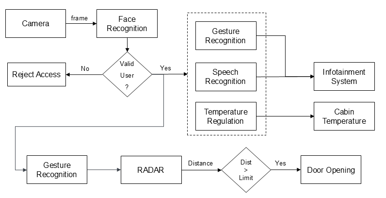

# Master's Thesis: Intelligent Vehicle Access and Exit System Design - A Machine Learning Approach Integrated into the Seat-Box Architecture

<h2>Highlights of the Thesis</h2>

My master's thesis is a collaboration project between the <b>[Institute of Industrial Automation and Software Engineering](https://www.ias.uni-stuttgart.de/en/)</b> at the <b>University of Stuttgart</b> and the <b>[Porsche Engineering Services](https://www.porscheengineering.com/de/peg/)</b> team.

Remarkably, the idea of thesis has been conceptualized and presented by Honda as [Honda concept zero](https://youtu.be/m_7gYNgjNRk) in CES 2025 summit in Las Vegas, Nevada, showcasing the capability to set the baseline for the standards of the vehicle's cabin designed in the coming future. However, this thesis already paved the foundation in this aspect.

This project work aims to reduce prevalant issues such as vehicle theft and road accidents that occur due to distracted driving by introducing biometric recognition capabilites through integration of machine learning algorithms.

<h2>Introduction</h2>

Cars have become so deeply integrated into modern society that it is almost unimaginable to envision a day without them. Initially, automobiles were equipped with basic amenities and lacked security measures. However, thanks to the significant advancements in the automotive industry, modern vehicles are now outfitted with various technologies that not only restrict access but also enhance the driving experience. Despite these innovations, several challenges remain unresolved. 

According to the [article](https://www.embitel.com/blog/embedded-blog/face-recognition-technology-a-modern-security-solution-for-cars), over one million car thefts were reported in the USA alone in 2022. Despite technological advancements, car access systems still rely on physical devices without considering the identity of the key holder. While keyless entry systems are considered more sophisticated than keys, they remain susceptible to signal interception. Existing infotainment systems necessitate manual interaction, diverting the driver’s focus and potentially leading to catastrophic outcomes.  According to the [NHTSA](https://www.nhtsa.gov/press-releases/traffic-crashes-cost-america-billions-2019), traffic crashes were responsible for an estimated $340 billion cost of vehicle damage in the US in 2019.

This thesis aims to develop an intelligent access and exit system by incorporating machine learning (ML) technologies into the seat-box architecture, enhancing both vehicle security and comfort features. The objective is to demonstrate the potential of ML techniques in advancing automotive technologies by realizing several target functions that simulate real-world scenarios.

<h2>General Architecture and Setup</h2>

  

The prototype design can be categorized into three layers at the system level, as illustrated in the above. At the sensor layer, various devices including a camera, speech recognition sensor, and temperature sensor, are mounted onto the prototype to capture environmental data. The controller layer encompasses devices such as Nvidia Jetson Orin AGX which process the input data. Machine learning frameworks are stored on these controllers to make predictions using trained models. Finally, at the actuator layer, actions are carried out based on the predictions derived from the input signals. 

The entire simulation is conducted on a rig structure that mimics a passenger vehicle. This rig comprises a chassis and an exo-skeleton designed to support the mounting of various components such as passenger seats, steering wheel, infotainment dashboard, and doors within the driver’s cockpit. It also accommodates a variety of sensors and actuators interfaced with controllers to perform specific tasks based on environmental conditions. 

The rig structure can be designed to be divided into three distinct sections. The first section includes the supporting framework for mounting the steering wheel and pedal stand, which represent the driver’s cockpit. Various controllers and a camera are placed in this section to facilitate driver detection and gesture recognition. Additionally, a speech sensor setup and the infotainment system are located here, making this section critical as it manages most of the system controls. 

The second and third sections house the passenger seats and motor-controlled doors. These zones are equipped with sensors to monitor temperature and humidity levels. The rig structure also includes glass panels at strategic positions to resemble a passenger vehicle, allowing cameras to capture the outside environment. Careful consideration must be given to the design of the cockpit to ensure sufficient space for passengers and flexibility for adjustments. 

<h2>Implementation</h2>

<h3>System Level Architecture</h3>

  

The entire architecture of the prototype can be categorized into three distinct sections, as illustrated in the above figure. The first category, the sensor site, comprises various components that collect data by sensing the environmental conditions. This data is transmitted to the controller site, where it is processed for model training and used to generate predictions. Based on these predictions, the actuators in the actuator site are either activated or deactivated through interfaces with the controller units. 

Communication protocols are established between the sensors, actuators, and controller units. Both serial communication and I2C protocols are used to facilitate data transfer among devices during the prototype simulation. Further details regarding the implementation of the prototype are provided in the subsequent sections. 

<h3>System Workflow</h3>

  

The camera mounted on the rig structure identifies the user attempting to access the vehicle’s entry system. Upon recognizing a gesture from an authorized user, the RADAR module begins calculating the distance to the user, and the vehicle door opens until it reaches the fully open state. If an obstacle is detected within the threshold range (equivalent to the door's length), the system halts the door's movement to prevent a possible collision.  

 The infotainment system and other actuators, such as the thermal management system and cabin lighting, can be controlled using either gestures or voice commands. As these comfort features are linked to driver identification, they are enabled exclusively for verified users seated behind the wheel. 

Typically, each target function is executed sequentially in a serial order. However, certain features require significant execution time. For instance, playing a song can take 3 – 5 minutes. Running the software in a strictly sequential manner would effectively disable all other functionalities until the song finishes playing. To address this issue, a separate process is created for time-intensive tasks, enabling parallel execution of target functions through a multiprocessing approach. This ensures that primary functionalities, such as driver identification and gesture recognition remain operational without interruption. The entire process iterates continuously throughout the driving cycle, terminating only when the vehicle is switched off. 

<h3>Hardware Components</h3>

**Table**

<h2>Results</h2>

**video**

<h2> Conclusion </h2>

In summary, this thesis explores the potential for enhancing vehicle security and improving the driving experience through the incorporation of ML techniques. Several target functions designed to improve vehicle security and user experience have been successfully realized through simulations conducted in an extensive driver’s cockpit. 

Traditional access systems, which rely on mechanical devices, have been replaced with a biometric recognition approach. This enables the system to identify users by extracting facial features, addressing security concerns effectively. Authorized users can interact with vehicle actuators through personalized gesture recognition systems, empowering the driver to activate or deactivate features with minimal cognitive distraction, thereby reducing road fatalities. These system functions have been developed without hardware constraints, allowing for adaptability across different markets. 

Additionally, the experimental setup is equipped with a speech recognition system to enable interaction with system functionalities while maintaining undivided attention. An extensive cockpit, providing comfortable and safe space for passengers while accommodating the hardware components, has been constructed to simulate the experiment.

Two primary concerns in ML applications: user privacy and the need for a large dataset are addressed through the implementation of FL that facilitates collaborative training across multiple clients without requiring the sharing of sensitive information with third parties. 

